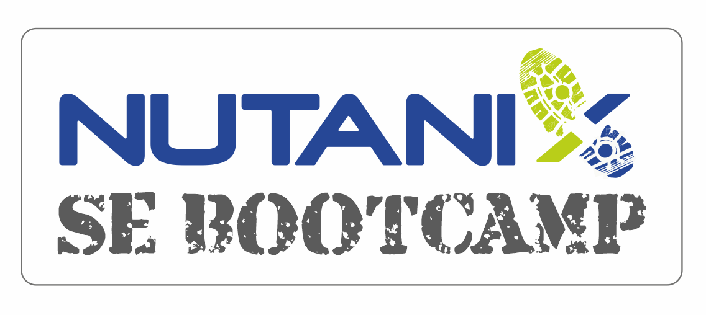

.. title:: SE Bootcamp

.. toctree::
  :maxdepth: 2
  :caption: Nutanix 101
  :name: _nutanix_101
  :hidden:

  /nutanix101/ntnx101

.. toctree::
  :maxdepth: 2
  :caption: Sizer
  :name: _sizer
  :hidden:

  /Sizer/sizing-nutanix

.. toctree::
  :maxdepth: 2
  :caption: Data Gathering
  :name: _data_gathering
  :hidden:

  /SizerQs/env-gathering

.. toctree::
  :maxdepth: 2
  :caption: Finding Information
  :name: _finding_information
  :hidden:

  /resources/finding-info

**Background**

The ever increasing Nutanix portfolio may seem overwhelming to a new member of the team so building up their knowledge starting at the core, the building block of Nutanix, will provide a stable point on which other functionality and features can be expanded upon.

Use the topics in this lab to assist newly on-boarded SEs in bringing them up to speed with the Nutanix architecture. It is recommended that an SE of an Architect role, or equivalent in experience, delivers the *Nutanix 101*, *Sizing* and *Data Gathering* content. The *Finding Information* section is mainly for general guidance and reference.

[For updates and feedback, send to darren@nutanix.com]
